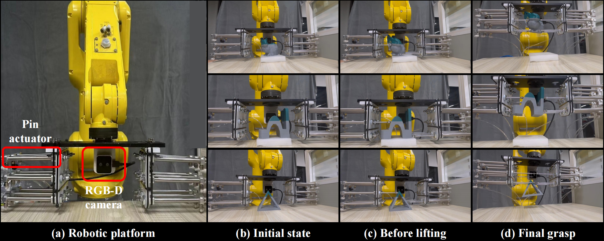

# pin-pression-gripper-video
Project of Pin-pression Grippers for Dexterous Grasping with Dynamic In-hand Adjustment

## Demonstration of real-world experiments
We develope a physical prototype of the pin-pression gripper. 

Physical configuration: We use pneumatic cylinders as the pin actuators and an RGB-D image as the observation signal. The pneumatic pressure is controlled via solenoid valves and relays, enabling the extension and retraction of the pins. The gripper, with 3×3 pins and one RGB-D camera, weighs 2.3 kg and is mounted on a FANUC robot for vertical movement. 

Visual perception processing: We retrained the network using PyBullet with the RGB-D image as observation. RGB and depth images are processed separately by two pre-trained Inception-v3 networks, and their features are concatenated into a 4096-dimensional vector as the state representation. Both the actor and critic network are implemented as Multi-Layer Perceptron structures. The entire network is trained end-to-end, allowing the pre-trained networks to be fine-tuned to better fit our task. 

Further work: We aim for our gripper to achieve good performance on as many shapes as possible while minimizing the number of pin actuators used. In our real-world experiments, we confirmed that a 3×3 resolution can achieve satisfactory grasping of multiple given objects, such as the Stanford bunny. As we elaborated in the future work, we will further implement a practical 4*4 version and consider applying the imitation learning and domain randomization to achieve the sim-to-real transfer like the gap between the designed state representation and RGB-D image.

## RL policy VS Extending all pins
|**Group**  | **RL policy** | **Extending all pins** |
|-----------|--------------|--------------|
| **#G1** |  |  |
| **#G2** |  |  |
| **#G3** |  |  |
| **#G4** |  |  |
| **#G5** |  |  |
| **#G6** |  |  |
| **#G7** |  |  |
| **#G8** |  |  |
<!-- Table -->
Our pin-pression gripper offers object adaption and in-hand re-orientation through dynamically adjusting the extension and retraction of pins.

## Demonstration of Grasp-then-Lift (GtL) motion

  
  

## Demonstration of Grasp-while-Lift (GwL) motion

  
  

#### Tips: If you find the gifs don't work, please try to refresh the page and wait for a while.
Code/data will be released soon.
