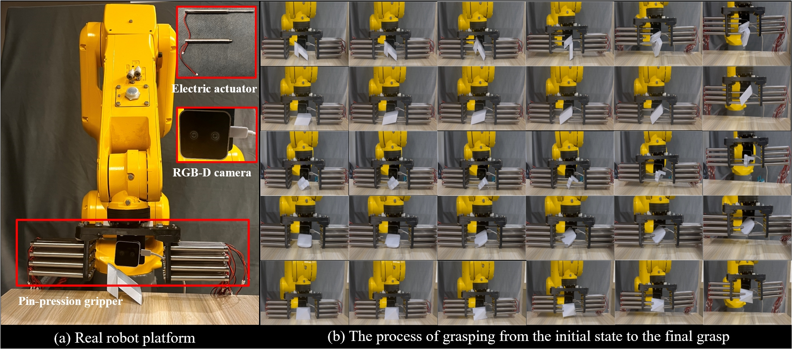
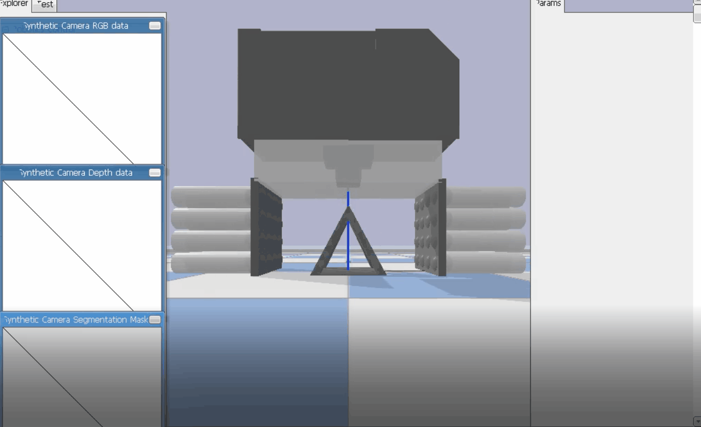
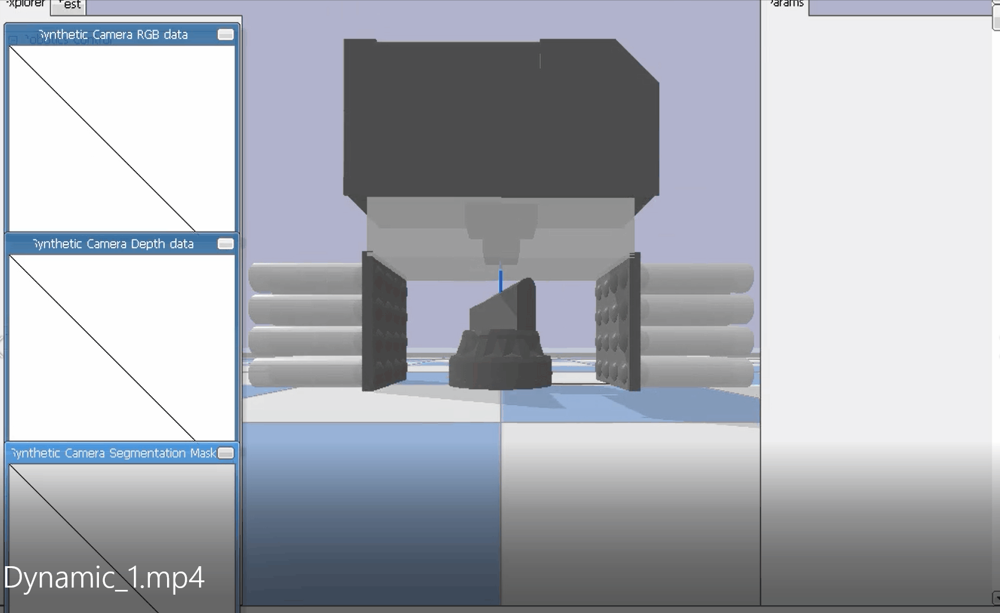
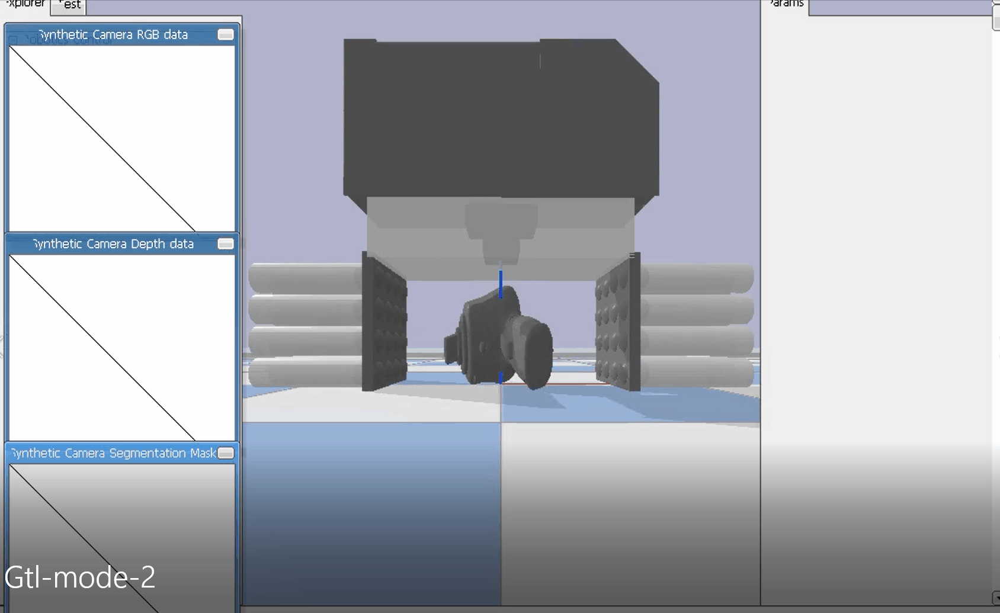

# Project of Designing Pin-pression Gripper and Learning its Dexterous Grasping with Online In-hand Adjustment

#### Tips: If you find the GIFs don't work, please try to refresh the page and wait for a while.

## Introduction
In this project, we introduce a novel pin-pression gripper that features adjusting its finger shape to conform to the target object.
We carefully devise a reinforcement learning algorithm to handle the online grasping skills.

## Real-world demo
We have developed a preliminary implementation of our pin-pression gripper.

We fabricate a real pin-pression gripper (a) equipped with an in-hand RGB-D camera for capturing observations. The gripper approaches the target object from the top (b), forms a basic closure against the object with pin movements (c), and achieves the final grasp (d).

### Demo video (Loading the GIF here may take a few minutes and thanks for your patience)
| | |
|:--:|:--:| 
| | |
| | |
| *Ours* |*Passive grasping* |

|  |
|:--:|
|*ours*|
 

The corresponding MP4 format demos have also been uploaded in the path: 'assets/Real-world/mp4_result'.

#### Hardware configuration
We utilize pneumatic cylinders as the actuators of our pin-pression gripper. Each cylinder is controlled via solenoid valves and relays, allowing for precise extension and retraction. To explore the minimum number of pin actuators in practice, the physical gripper is designed with a 3x3 resolution, weighing 2.3kg. Both gripper size and pin sizes align with the simulated gripper. Our gripper is mounted on a FANUC Robot for vertical movement.  

#### Observation signal and control policy
To enable real-world deployment, we distill the control policy learned in the simulator into a student policy that only receives RGB-D images, the extension values of each pin actuator, and the position of the gripper as observation signals. These signals are embedded and concatenated as the state feature and then fed to the student policy for grasping actions. In our real-world experiments, we confirmed that our gripper can achieve satisfactory grasping of multiple objects, such as Stanford Bunny, even only with a 3×3 pin resolution.

## Data preparation
We collect several challenging objects to further demonstrate the necessity of our on-line grasping approach. 
The challenge datasets: Chal-H dataset with 50 flat shapes and Chal-T dataset consisting of 58 objects with inclined surfaces or tetrahedron-like shapes. You can download the prepared dataset from [here](https://drive.google.com/drive/folders/1nx7LngqmtAvSGkX44yYfAoMbGQITP_i1?usp=drive_link).

## Animation result 
Using our pin-pression gripper, we found that passive grasping method which heuristically extends all pins struggles, particularly with objects with inclined surfaces. It is necessary to adopt reinforcement learning (RL) policies for the pin-pression gripper to enable adaptive in-hand object adjustments, thereby achieving better force closure and efficient grasping. 
#### RL policy vs. Passive grasping (Loading the GIF may take a while and thanks for your patience)
|**Object**  | **RL policy** | **Passive grasping** |
|-----------|--------------|--------------|
| **#O1** |  |  |
| **#O2** |  |  |
| **#O3** |  |  |
| **#O4** |  |  |
| **#O5** |  |  |
| **#O6** |  |  |
<!-- | **#O7** |  |  | -->
<!-- | **#O8** |  |  | -->
<!-- Table -->

<!-- ## Demonstration of Grasp-then-Lift (GtL) motion

  
  

## Demonstration of Grasp-while-Lift (GwL) motion

  
  

 -->

#### Code/data will be released soon.
